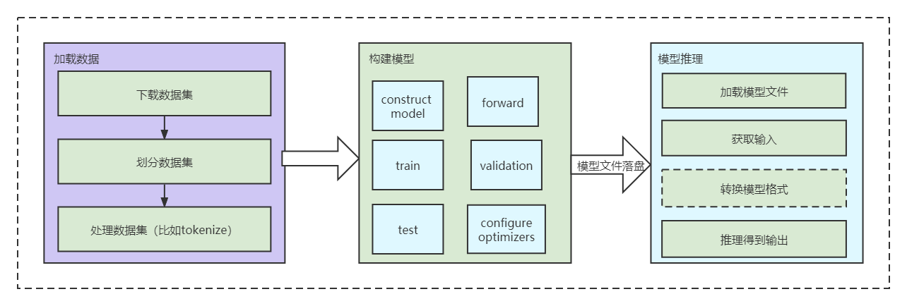
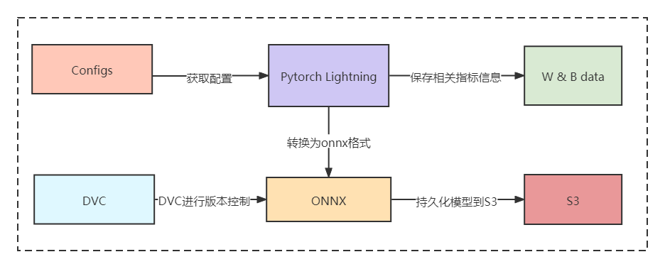
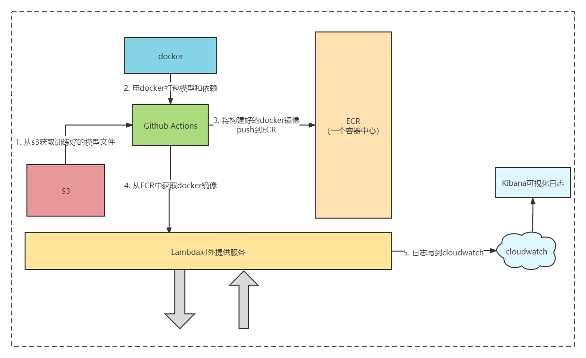

# MLOpsDemo
MLOps的简单demo，旨在理清MLOps的基本流程，为后续有空搭建全流程闭环的MLOps平台做预研。

## setup
基本的机器学习/深度学习流程如下图所示：

setup部分使用Pytorch Lightning搭建了一个简单的文本语法正确性检测（二分类问题）的框架，涵盖了上述流程的全部内容。本项目接下来的工作也将基于这个框架进行扩展，实现MLOps的基本功能。

## Monitoring,Versioning & Convert
该部分使用W&B进行模型相关指标（如Accuracy、Precision、Recall以及F1）记录，方便后续监控；
使用DVC进行模型和数据集的存储和版本控制，方便后续模型的自动化迭代；
使用ONNX来统一模型格式（因为模型可能由不同的工具训练），方便后续模型部署。

## Deployment & Serving
该部分使用GitHub Actions、借助ECR实现自动创建具有模型推理服务的docker镜像；
使用AWS Lambda，使模型对外提供服务；通过使用Cloudwatch以及Kibana实现对模型预测的可视化监控。
